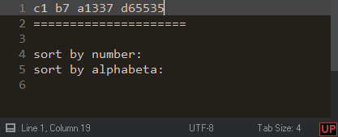

## 安裝方式
1. 從官方網站下載Sublime Text 3 (推薦從全新的Sublime Text 3開始安裝)
2. 打開Sublime Text並且打開Console (按下``ctrl+` ``)
3. 將以下程式碼貼入Console的命令列後按下enter鍵來執行
~~~python
import urllib.request,os,hashlib;pf = 'Package Control.sublime-package';ipp = sublime.installed_packages_path();urllib.request.install_opener( urllib.request.build_opener( urllib.request.ProxyHandler()) );by = urllib.request.urlopen( 'http://packagecontrol.io/' + pf.replace(' ', '%20')).read();sublime.message_dialog('Error validating download (size %d < 200k), please try manual install' % (len(by))) if len(by) < 1024 * 250 else open(os.path.join(ipp, pf), 'wb').write(by);pks = sublime.load_settings('Package Control.sublime-settings');pks.set("installed_packages", list(set(pks.get("installed_packages", []) + ['RansTool (ranlempow)'])));pks.set('repositories', ["https://raw.githubusercontent.com/ranlempow/Sublime-Life/master/repository.json"]);sublime.save_settings('Package Control.sublime-settings');sublime.set_timeout(lambda: sublime.message_dialog("Please restart Sublime Text to continuity install Sublime-Life"), 500);
~~~
4. 確認提是視窗後重新啟動Sublime Text
5. 過幾秒之後會開始一連串的安裝, 請耐心等待完成之後即可使用Sublime Life.

## 區塊編輯

- `Tab`: 區塊縮排進一階
- `Shift+Tab`: 區塊縮排退一階
- `Ctrl+/`: 註解區塊/取消註解區塊
- `F9`: 區塊排序
- `Ctrl+Shift+V`: 貼上並貼齊縮排
- `Ctrl+Alt+V`: 從歷史貼上

## 擴展選取

- `Ctrl+D`: 選取整個單字  
- `Ctrl+L`: 選取整行
- `Ctrl+Shift+Space`: 選取一段文字
- `Ctrl+M`: 跳到對稱的括號
- `Ctrl+Shift+M`: 選取括號內部的文字
- `Alt+[...]`: 移動過單字
- `Alt+Shift+[...]`: 選取過單字

## 快速搜尋

- `Ctrl+E`: 準備搜尋游標所在的單字
- `F3`: 搜尋下一個
- `Alt+F3`: 全選搜尋的單字 

## 風格化

一般文字檔使用使用"細明體"字體, 讓中文可以更融洽的與英文並存. 所謂的一般文字檔是指"Markdown"和"Plain Text"這兩個語法.程式碼原始檔使用"consolas"字體, 這個字體渾厚有力量而且他的表點符號清晰不混淆.

程式碼高亮使用"Ancient", 柔和的對比降低眼睛疲勞, 溫暖的色調減少螢幕對眼球的傷害, 可愛的配色讓寫程式時心情更加輕鬆.

編輯器風格使用"Boxy Tomorrow", 他簡單的設計很容易與其他部分做出適合的搭配.

## 中文輸入法會正確的顯示在畫面中

使用中文輸入法時, 提示框不在另外顯示, 而是直接將打出的文字顯示在游標處.

## 遵守 EditorConfig 中的設定

對UTF-8有著高度的支援

Example file

Below is an example .editorconfig file setting end-of-line and indentation styles for Python and JavaScript files.
~~~editconfig
# EditorConfig is awesome: http://EditorConfig.org

# top-most EditorConfig file
root = true

# Unix-style newlines with a newline ending every file
[*]
end_of_line = lf
insert_final_newline = true

# Matches multiple files with brace expansion notation
# Set default charset
[*.{js,py}]
charset = utf-8

# 4 space indentation
[*.py]
indent_style = space
indent_size = 4

# Tab indentation (no size specified)
[Makefile]
indent_style = tab

# Indentation override for all JS under lib directory
[lib/**.js]
indent_style = space
indent_size = 2

# Matches the exact files either package.json or .travis.yml
[{package.json,.travis.yml}]
indent_style = space
indent_size = 2
~~~

## 在檔案中顯示與上一版本不同之處

- `F5`: 開啟或關閉版本差異顯示
啟動時間需要數十秒

## 拼寫檢查與拼寫校正(英文)

- `F6`: 開啟或關閉拼寫檢查
- `Ctrl+F6`: 下一個拼寫錯誤的位置
- `Ctrl+Alt+F6`: 拼寫校正: 改正圈選處拼錯的英文單字

## 存檔時顯示程式碼中的錯誤

- `F10`: 開啟或關閉錯誤顯示, 並且存檔

遵守`tox.ini`
~~~
[flake8]
# E303    too many blank lines (3)
# E306    expected 1 blank line before a nested definition
# W293    blank line contains whitespace
# W391    blank line at end of file
ignore = E303,E306,W293,W391

max-line-length = 120
~~~

## 函數變色

## 函數自動完成

## 函數提示

## Goto Anything 快速跳躍

- `Ctrl+P`: 顯示檔案列表
- `Ctrl+R`: 顯示符號表
- `Ctrl+Shift+R`: 顯示整個專案的符號表
- `Ctrl+G`: 跳到指定的行數
- `F12`: 跳到該符號定義處
- `Ctrl+PageUp`: 上一分頁
- `Ctrl+PageDown`: 下一分頁
- `Ctrl+W`: 關閉分頁

## 專案操作

- `Ctrl+Alt+W`: 關閉專案
- `Ctrl+Alt+S`: 切換專案
- `Ctrl+0`: 切換到檔案列

## Todo List 追蹤清單

- `Alt+T`: 顯示追蹤清單

